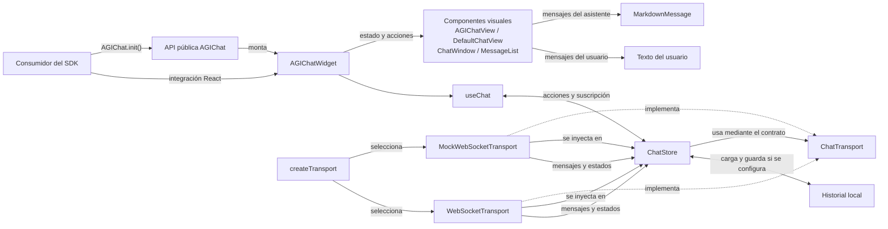

# Arquitectura de AGIChat Widget SDK

## 1. Descripción general

AGIChat Widget SDK es una biblioteca para integrar un chat con un agente en un sitio web. Puede usarse mediante la API pública `AGIChat`, que monta el widget en la página, o mediante el componente React `AGIChatWidget`.

La API `AGIChat` crea un contenedor con Shadow DOM para aislar los estilos del widget de los estilos de la página. La integración React permite usar el componente dentro de una aplicación React existente.

## 2. Arquitectura del proyecto

El proyecto se organiza en áreas funcionales. Cuenta con interfaz visual, lógica del chat, estado, transporte, tipos compartidos, estilos y pruebas. Puede entenderse como una arquitectura por capas funcionales; no son capas aisladas de forma estricta, pues los componentes React conectan la vista con la lógica mediante el hook `useChat`.

- **`AGIChatWidget`** recibe la configuración o un `ChatStore` existente, crea el store cuando hace falta y conecta la vista elegida con el estado y las acciones del chat. Por defecto usa `DefaultChatView`.
- **`useChat`** suscribe React al store mediante `useSyncExternalStore`, conecta y desconecta el transporte con el ciclo de vida del componente, y expone acciones como enviar, reintentar y limpiar.
- **`ChatStore`** conserva los mensajes y el estado de conexión, envía los mensajes del usuario, procesa eventos del transporte y reemplaza por ID los fragmentos acumulados de una respuesta en streaming. Puede recibir un historial opcional.
- **`ChatTransport`** define el contrato que el store usa para conectarse, desconectarse, enviar mensajes y suscribirse a eventos.
- **`MockWebSocketTransport`** implementa ese contrato para simular la conexión y entregar respuestas en fragmentos.
- **`WebSocketTransport`** implementa el contrato para comunicarse con un servidor WebSocket, procesar sus eventos y administrar reconexiones.

`createTransport` selecciona y crea la implementación concreta según la configuración. `createChatStore` obtiene de esa fábrica una instancia de transporte y se la pasa al constructor de `ChatStore`. El store depende del contrato `ChatTransport`, no de una implementación concreta.

No existe una clase Adapter separada. Lo que sí está implementado es un contrato común con transportes intercambiables, elegidos por `createTransport`. Así se puede cambiar el mecanismo de comunicación sin cambiar la lógica principal del store.

## 3. Diagrama de alto nivel



El consumidor puede inicializar el widget mediante `AGIChat.init()` o usar `AGIChatWidget` en React. El widget presenta el estado del chat mediante sus vistas y se conecta a `ChatStore` con `useChat`. La fábrica escoge uno de los transportes, que implementan el contrato utilizado por el store. Las vistas muestran el Markdown del asistente mediante `MarkdownMessage` y el texto del usuario de forma literal. El historial local participa solo cuando se configura la persistencia.

## 4. Flujo de un mensaje

Al inicializar el widget, `createStoreFromOptions` prepara las opciones y llama a `createChatStore`. Este obtiene una instancia mediante `createTransport` y la entrega al constructor de `ChatStore`. Esa selección del transporte ocurre antes de enviar mensajes.

El flujo de envío y respuesta es el siguiente:

1. El usuario escribe y envía un mensaje desde la vista.
2. La vista llama a la acción `onSend` que recibió del widget.
3. El widget conecta esa acción con `send` de `useChat`.
4. `useChat` delega el envío en `ChatStore`.
5. `ChatStore` agrega el mensaje del usuario al estado y lo envía mediante la instancia de `ChatTransport` que recibió al crearse.
6. La instancia es `MockWebSocketTransport` o `WebSocketTransport`, según la configuración seleccionada por `createTransport`.
7. El transporte emite eventos de mensaje y estado. Para una respuesta en streaming, los fragmentos con el mismo ID actualizan el mensaje existente en `ChatStore`.
8. `useChat` recibe el cambio de estado y React vuelve a renderizar la vista.
9. Si el mensaje es del asistente, `MessageList` o `DefaultChatView` presenta su contenido mediante `MarkdownMessage`.
10. Si el mensaje es del usuario, la vista presenta su contenido como texto normal.

Si se habilita `persistHistory`, `ChatStore` carga el historial al crearse, guarda mensajes completos y lo limpia cuando se solicita. La implementación predeterminada usa `localStorage` mediante `createLocalStorageHistory`.

## 5. Estructura de carpetas

```text
src/
├── components/       # Componentes visuales, incluida la lista y el renderer Markdown
├── core/             # Widget, API, hook, store, historial y lógica central
├── transport/        # Fábrica e implementaciones mock y WebSocket
├── types/            # Tipos compartidos, incluido Message y ChatTransport
├── styles/           # Estilos del widget React
└── test/             # Configuración compartida y transporte falso para pruebas

demo/                 # Aplicación demo e integración del script embebible
docs/                 # Documentación del SDK, transporte y arquitectura
.github/workflows/    # Automatización de CI, despliegue y release
```

Las pruebas unitarias y de componentes se encuentran junto a los módulos correspondientes con nombres `*.test.ts` o `*.test.tsx`. `src/test/` contiene utilidades compartidas, no todas las pruebas.

## 6. Cómo escalar el proyecto

- Agrega nuevos componentes visuales en `src/components/` y conéctalos mediante las vistas existentes cuando corresponda.
- Agrega lógica que coordina el chat en `src/core/`, manteniendo el estado centralizado en `ChatStore` cuando deba compartirse entre vistas.
- Coloca tipos públicos o compartidos en `src/types/`. Si un tipo debe formar parte de la API pública, expórtalo desde los puntos de entrada correspondientes.
- Agrega transportes en `src/transport/` implementando `ChatTransport` y registra su selección en `createTransport`.
- Coloca cada prueba junto al módulo que verifica y reutiliza las utilidades de `src/test/` cuando sean aplicables.
- Mantén los estilos del widget React en `src/styles/` y los estilos predeterminados que se insertan en el widget embebible en `src/core/defaultStyles.ts`.

## 7. Decisiones arquitectónicas

- **Interfaz separada de comunicación:** las vistas reciben mensajes y acciones; no necesitan conocer el protocolo WebSocket ni cómo se simula una respuesta.
- **Transporte intercambiable:** `ChatStore` usa el contrato `ChatTransport`. `createTransport` concentra la selección entre mock y WebSocket, de modo que las implementaciones puedan sustituirse sin cambiar el flujo principal del store.
- **Pruebas aisladas:** el store puede probarse con `FakeTransport`, y los componentes visuales pueden verificarse con mensajes y acciones de prueba sin establecer una conexión real.
- **Crecimiento ordenado:** las carpetas reflejan responsabilidades existentes y permiten agregar componentes, lógica, tipos, transportes y pruebas en el área correspondiente.
- **Integración flexible:** `AGIChatWidget` permite integrarlo en una aplicación React; la API `AGIChat` monta el mismo widget para sitios que usan el script embebible y lo aísla con Shadow DOM.

## 8. Renderizado Markdown y seguridad

Los mensajes del asistente se presentan con `MarkdownMessage`, tanto en `MessageList` como en `DefaultChatView`. El renderer usa `react-markdown` con `remark-gfm` para tablas y otras extensiones de GitHub Flavored Markdown. `rehype-highlight` resalta bloques de código cuando el bloque indica un lenguaje.

El contenido recibido se trata como no confiable. `rehype-sanitize` sanitiza el árbol renderizado y no se habilita HTML crudo mediante `rehype-raw`. Los mensajes del usuario no pasan por el renderer Markdown y permanecen como texto normal.

```

```
