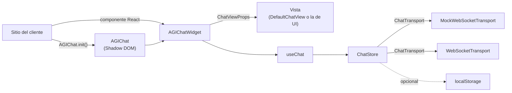

# SDK: widget, API `AGIChat` y hook `useChat`

Esta guía explica cómo integrar el widget de AGIChat en un sitio y cómo está
organizada la lógica del chat (`src/core/`). Para los detalles de la conexión y el
protocolo WebSocket, ver [TRANSPORT.md](TRANSPORT.md).

## Capas



- **`ChatStore`**: estado del chat sin React. Agrega el mensaje del usuario, lo envía,
  reemplaza por `id` los fragmentos en streaming, cuenta respuestas pendientes
  ("escribiendo"), marca envíos fallidos para reintentarlos y guarda el historial.
- **`useChat`**: conecta un `ChatStore` con React (`useSyncExternalStore`).
- **`AGIChatWidget`**: une el store con una vista que cumple `ChatViewProps`.
- **`AGIChat`**: API global para sitios sin React; monta el widget en un Shadow DOM.

## Integración con React

```tsx
import { AGIChatWidget } from 'agichat-widget';

export function App() {
  return (
    <AGIChatWidget
      transport="mock"
      title="Soporte"
      welcomeMessage="Hola, ¿en qué te puedo ayudar?"
      persistHistory
    />
  );
}
```

Para el servidor real: `transport="websocket" endpoint="wss://ejemplo.com/chat"`.
La configuración de conexión solo se lee al montar el componente.

Props adicionales del componente:

| Prop                    | Descripción                                                             |
| ----------------------- | ----------------------------------------------------------------------- |
| `store`                 | Usar un `ChatStore` ya creado en lugar de la configuración de conexión. |
| `open` / `onOpenChange` | Modo controlado: el padre decide si la ventana está abierta.            |
| `defaultOpen`           | Modo no controlado: si arranca abierta (por defecto `false`).           |
| `view`                  | Componente de vista propio que recibe `ChatViewProps`.                  |
| `styles`                | CSS propio en lugar de los estilos por defecto (`''` = sin estilos).    |

## Script embebible (sin instalar nada)

Para sitios sin React ni bundler existe `dist/agichat.embed.js`: un solo archivo UMD que
ya incluye React (unos 75 kB con gzip). Se agrega con una etiqueta y se configura con
atributos `data-*`. El archivo viene en el paquete que publica el workflow de release (o
se genera con `npm run build:embed`) y el sitio lo sirve como cualquier otro `.js`:

```html
<script
  src="/js/agichat.embed.js"
  data-transport="mock"
  data-title="Soporte"
  data-welcome-message="Hola, ¿en qué te puedo ayudar?"
></script>
<script>
  AGIChat.on('message', (message) => console.log(message.role, message.content));
</script>
```

Con `data-transport` el widget se monta solo. Sin ese atributo no se monta nada y el sitio
llama `AGIChat.init({...})` cuando quiera. Todo queda en `window.AGIChat` con la misma API
de la sección siguiente.

| Atributo               | Equivale a       | Ejemplo                                 |
| ---------------------- | ---------------- | --------------------------------------- |
| `data-transport`       | `transport`      | `mock` o `websocket`                    |
| `data-endpoint`        | `endpoint`       | `wss://ejemplo.com/chat`                |
| `data-title`           | `title`          | `Soporte`                               |
| `data-placeholder`     | `placeholder`    | `Escribe aquí`                          |
| `data-welcome-message` | `welcomeMessage` | `Hola`                                  |
| `data-theme`           | `theme`          | `light`, `dark` o `auto`                |
| `data-open`            | `defaultOpen`    | presente o `true` para arrancar abierto |
| `data-persist-history` | `persistHistory` | presente, `true`, `false` o una llave   |
| `data-target`          | `target`         | `#contenedor-del-chat`                  |

Si la configuración es inválida (por ejemplo `websocket` sin `data-endpoint`), el error se
muestra en la consola y la página del cliente sigue funcionando. Si el script está en el
`<body>` y no tiene `data-target`, el widget se monta en ese momento; si no, espera a que
termine de cargar el HTML. `AGIChat.on` se puede usar desde cualquier script después del
SDK, aunque el widget todavía no esté montado.

El build se genera con `npm run build:embed` (también lo hace `npm run build`). La demo
publicada incluye `embed.html`, una página sin React que usa este script.

## Integración sin React: `AGIChat.init()`

```ts
import { AGIChat } from 'agichat-widget';

AGIChat.init({ transport: 'mock', title: 'Soporte' });

AGIChat.on('message', (message) => {
  console.log(message.role, message.content);
});

AGIChat.open();
```

El widget se monta en un `<div data-agichat>` con **Shadow DOM**: el CSS del sitio no
afecta al widget y los estilos del widget no se salen al sitio. Llamar `init` otra vez
reemplaza el widget anterior. `open`, `close`, `toggle` y `send` antes de `init` lanzan
un error claro. `on` y `off` sí se pueden usar antes de `init`: los listeners quedan
registrados en `AGIChat` y siguen activos aunque se haga `destroy` e `init` otra vez.

| Método                    | Descripción                                                     |
| ------------------------- | --------------------------------------------------------------- |
| `AGIChat.init(options)`   | Monta el widget y devuelve la instancia.                        |
| `AGIChat.open()`          | Abre la ventana del chat.                                       |
| `AGIChat.close()`         | Cierra la ventana (queda el botón flotante).                    |
| `AGIChat.toggle()`        | Abre o cierra.                                                  |
| `AGIChat.isOpen()`        | `true` si la ventana está abierta.                              |
| `AGIChat.send(texto)`     | Envía un mensaje como si el usuario lo escribiera.              |
| `AGIChat.on(evento, fn)`  | Escucha un evento. Devuelve la función para dejar de escuchar.  |
| `AGIChat.off(evento, fn)` | Deja de escuchar.                                               |
| `AGIChat.destroy()`       | Quita el widget y cierra la conexión (los listeners se quedan). |

Para tener varios chats en la misma página se usa `createAGIChat(options)`, que devuelve
una instancia independiente con los mismos métodos.

### Eventos

| Evento    | Dato              | Cuándo                                                                |
| --------- | ----------------- | --------------------------------------------------------------------- |
| `message` | `Message`         | Mensaje completo: del usuario al enviarse, del asistente al terminar. |
| `state`   | `ConnectionState` | Cambia el estado de la conexión.                                      |
| `error`   | `Error`           | Falla un envío o el servidor reporta un error.                        |
| `open`    | (ninguno)         | Se abre la ventana.                                                   |
| `close`   | (ninguno)         | Se cierra la ventana.                                                 |

`message` no se dispara por cada fragmento del streaming, solo cuando el mensaje termina.

## Opciones

`AGIChatOptions` es la `WidgetConfig` del transporte más opciones de interfaz:

| Opción           | Tipo                          | Por defecto              | Descripción                                                     |
| ---------------- | ----------------------------- | ------------------------ | --------------------------------------------------------------- |
| `transport`      | `'mock' \| 'websocket'`       | (requerida)              | Tipo de conexión.                                               |
| `endpoint`       | `string`                      | (requerida en websocket) | URL `ws:` o `wss:` del agente.                                  |
| `mock`           | `MockTransportOptions`        |                          | Retrasos y respuesta del mock.                                  |
| `websocket`      | `WebSocketTransportOptions`   |                          | Reintentos y timeout del WebSocket real.                        |
| `title`          | `string`                      | `'AGIChat'`              | Título del encabezado.                                          |
| `placeholder`    | `string`                      | `'Escribe tu mensaje…'`  | Texto de ayuda del input.                                       |
| `welcomeMessage` | `string`                      |                          | Se muestra mientras no hay conversación.                        |
| `theme`          | `'light' \| 'dark' \| 'auto'` | `'auto'`                 | `auto` sigue el tema del sistema.                               |
| `persistHistory` | `boolean \| string`           | `false`                  | `true` usa la llave `agichat:history`; un string usa esa llave. |

`AGIChat.init` acepta además `target` (elemento o selector donde montar, por defecto
`document.body`), `defaultOpen`, `view` y `styles`.

## Tema

Los estilos por defecto usan variables CSS. Las variables sí atraviesan el Shadow DOM,
así que el sitio puede cambiarlas sin tocar el widget. Con `AGIChat.init()` se definen en
`[data-agichat]`; con el componente de React, en `.agichat` o en cualquier contenedor padre:

```css
[data-agichat],
.agichat {
  --agichat-primary: #0f766e;
  --agichat-radius: 8px;
}
```

| Variable               | Uso                                 |
| ---------------------- | ----------------------------------- |
| `--agichat-primary`    | Botón flotante, encabezado y envío. |
| `--agichat-on-primary` | Texto sobre el color primario.      |
| `--agichat-bg`         | Fondo de la ventana.                |
| `--agichat-surface`    | Burbujas del asistente y bordes.    |
| `--agichat-text`       | Texto principal.                    |
| `--agichat-muted`      | Texto secundario.                   |
| `--agichat-danger`     | Errores.                            |
| `--agichat-radius`     | Radio de la ventana.                |
| `--agichat-font`       | Tipografía.                         |

## Crear una vista propia: `ChatViewProps`

La lógica y la interfaz están separadas por un contrato. Cualquier componente que reciba
`ChatViewProps` puede ser la vista del widget:

```tsx
import type { ChatViewProps } from 'agichat-widget';

export function MiVista({ messages, open, onOpen, onClose, onSend }: ChatViewProps) {
  // ...
}

<AGIChatWidget transport="mock" view={MiVista} />;
AGIChat.init({ transport: 'mock', view: MiVista });
```

| Prop                                     | Tipo              | Descripción                                    |
| ---------------------------------------- | ----------------- | ---------------------------------------------- |
| `messages`                               | `Message[]`       | Historial; `content` es Markdown.              |
| `isTyping`                               | `boolean`         | Hay respuestas pendientes del asistente.       |
| `connectionState`                        | `ConnectionState` | Estado de la conexión.                         |
| `failedMessageIds`                       | `string[]`        | Mensajes del usuario que se pueden reintentar. |
| `error`                                  | `Error \| null`   | Último error.                                  |
| `open`                                   | `boolean`         | Si la ventana está abierta.                    |
| `title`, `placeholder`, `welcomeMessage` | `string`          | Textos configurados.                           |
| `onSend(texto)`                          | función           | Enviar un mensaje.                             |
| `onRetry(id)`                            | función           | Reintentar un mensaje fallido.                 |
| `onOpen()`, `onClose()`                  | función           | Abrir o cerrar la ventana.                     |

`DefaultChatView` (en `src/core/DefaultChatView.tsx`) es la implementación de referencia:
botón flotante con `aria-expanded`, ventana `role="dialog"`, lista `aria-live`, Enter para
enviar, Shift+Enter para salto de línea, Escape para cerrar y manejo del foco.

## Lógica sin la vista: `ChatStore` y `useChat`

```tsx
import { createChatStore, createLocalStorageHistory, useChat } from 'agichat-widget';

const store = createChatStore(
  { transport: 'mock' },
  { history: createLocalStorageHistory('mi-chat') },
);

function MiChat() {
  const { messages, isTyping, connectionState, failedMessageIds, send, retry, clear } =
    useChat(store);
  // ...
}
```

- `useChat` conecta al montar y desconecta al desmontar. No destruye el store (así
  funciona con `StrictMode`); quien lo crea llama `store.destroy()` cuando ya no se usa.
- `store.send(texto)` agrega el mensaje y lo envía. Si falla (por ejemplo sin conexión),
  su `id` queda en `failedMessageIds` y `store.retry(id)` lo reenvía con el mismo `id`.
- Si la conexión se cae a mitad de una respuesta, esa respuesta se cierra con el texto
  que alcanzó a llegar para que no quede "en streaming" para siempre.
- `store.clear()` vacía el historial, también el guardado.

## Historial

`createLocalStorageHistory(llave, { limit })` guarda los últimos `limit` mensajes
completos (50 por defecto). Si `localStorage` no existe, está bloqueado, lleno o tiene
datos corruptos, el chat funciona igual, simplemente sin historial. Los mensajes que no
se pudieron enviar no se guardan. La interfaz `ChatHistory` permite cambiar
`localStorage` por otro almacenamiento (por ejemplo el backend en la fase 2).

## Probarlo localmente

```bash
npm run dev
```

La demo en `http://localhost:5173` monta `<AGIChatWidget />` con el mock. Para probar la
API global, en la consola del navegador:

```js
const { AGIChat } = await import('/src/index.ts');
AGIChat.init({ transport: 'mock', title: 'Prueba', defaultOpen: true });
AGIChat.on('message', (m) => console.log(m.role, m.content));
```

Para probar el script embebible real:

```bash
npm run build:embed
npm run dev
```

y abrir `http://localhost:5173/embed.html`. Con `npm run build` y `npm run preview` se
prueba igual que en GitHub Pages.
